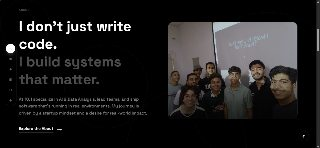

# Omar Mohamed Gad — Personal Portfolio

> **"Engineering Ideas Into Reality"**  
> A modern, cinematic portfolio website built to showcase real projects, real milestones, and a real story.

[](https://your-vercel-url.vercel.app)
[](https://nextjs.org/)
[](https://www.typescriptlang.org/)
[](https://tailwindcss.com/)

---

## 📸 Screenshots

| About | Journey — Cairo ICT |
|-------|-------------------|
|  |  |

| Journey — EduTech Event |
|------------------------|
|  |

---

## 🔗 Live Demo

**[→ View Live Site](https://omar-gad.netlify.app)**

---

## 🛠 Technologies Used

| Technology | Purpose |
|------------|---------|
| **Next.js 16** | React framework — App Router, SSR, API routes |
| **TypeScript 5** | Static typing for safer, self-documenting code |
| **Tailwind CSS 4** | Utility-first styling & responsive design |
| **Framer Motion 12** | Scroll-triggered animations & gesture interactions |
| **Nodemailer 8** | Server-side email sending via the contact form API |
| **typewriter-effect** | Typing animation in the Hero section |
| **React Icons / Lucide** | Icon libraries used throughout the UI |
| **Vercel** | Hosting, automatic deployments, serverless functions |

---

## 🚀 Setup Instructions

### Prerequisites

- Node.js **18.x** or higher
- npm (comes with Node.js)
- Git

### Installation

```bash
# 1. Clone the repository
git clone https://github.com/your-username/my-portfolio.git
cd my-portfolio

# 2. Install dependencies
npm install

# 3. Configure environment variables
# Create a .env.local file in the root with:
SENDER_EMAIL=your-gmail@gmail.com
APP_PASSWORD=your-gmail-app-password
RECEIVER_EMAIL=your-personal-email@gmail.com

# 4. Start the development server
npm run dev
```

Open **[http://localhost:3000](http://localhost:3000)** in your browser.

### Available Scripts

```bash
npm run dev      # Development server with hot reload
npm run build    # Production build
npm run start    # Start production server (after build)
npm run lint     # Run ESLint
```

> **Contact Form:** Requires a Gmail App Password. Generate one at  
> Google Account → Security → 2-Step Verification → App Passwords

---

## 📁 Project Structure

```
my-portfolio/
├── app/                  # Next.js App Router (pages + API routes)
│   ├── page.tsx          # Landing page
│   ├── about/            # /about
│   ├── journey/          # /journey
│   ├── projects/         # /projects
│   ├── contact/          # /contact
│   ├── media/            # /media
│   └── api/contact/      # Contact form API (Nodemailer)
├── sections/             # Full-page section components
├── components/           # Shared UI components
│   ├── macOS/            # Draggable window, Terminal, Notebook
│   └── ui/               # Sidebar, AnimatedBackground, BackToTop
├── lib/data/             # Project & milestone data
├── types/                # TypeScript interfaces
└── public/               # Static assets (images, videos, PDFs)
```

---

## 👤 Author

**Omar Mohamed Gad**  
WE Applied Technology School — IT Department  
Web Programming · Grade 2 · 2025–2026

---

*Built with Next.js · Deployed on Vercel*
